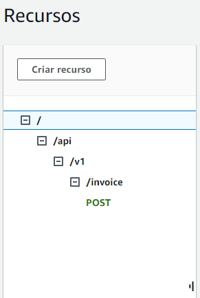
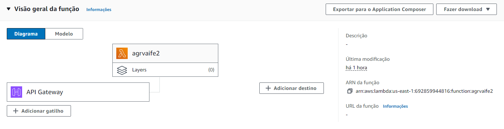
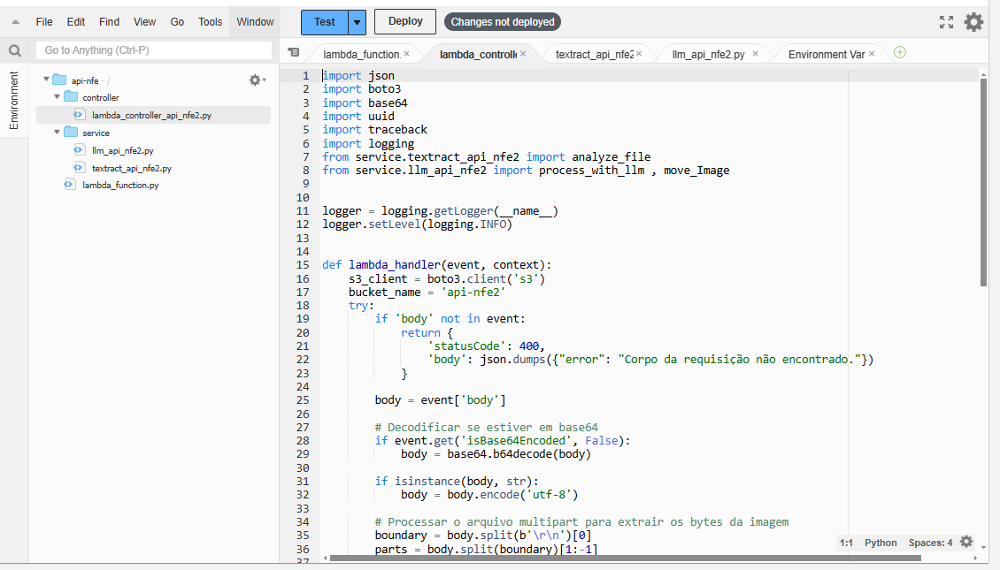
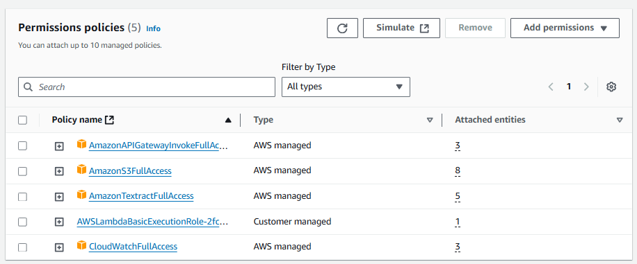
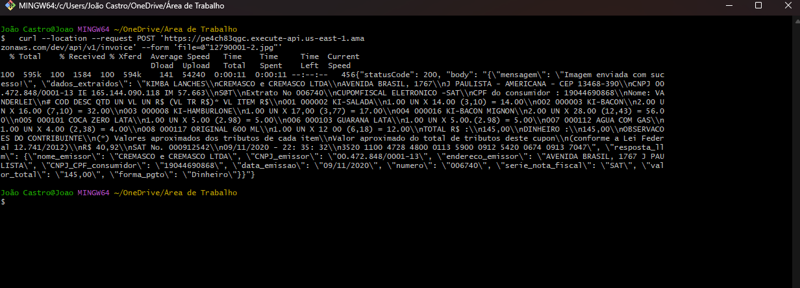
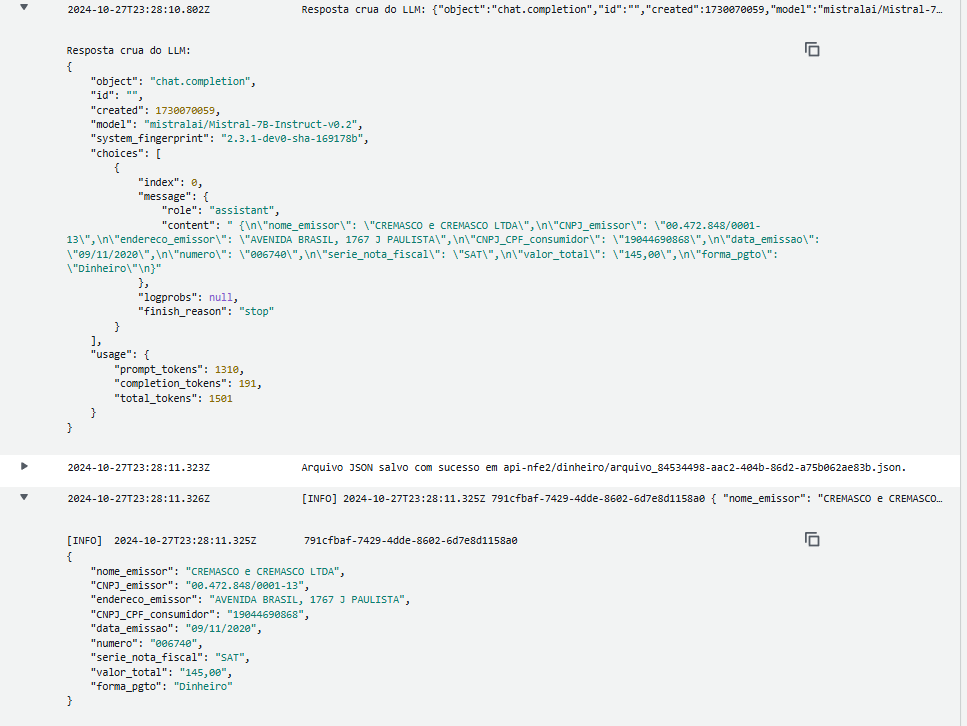

# Projeto NFE

O ***Projeto NFE*** é uma API REST em Python, criada para processar imagens de notas fiscais eletrônicas de forma automática. Utilizando o Amazon Textract, a API extrai o texto das imagens e aplica técnicas de NLP para identificar e classificar os elementos extraídos. Uma LLM refina esses dados e os organiza em um JSON estruturado, enquanto as notas fiscais são armazenadas no S3 e organizadas conforme o método de pagamento. Logs completos são registrados no CloudWatch, facilitando o monitoramento e a auditoria do processo.

***

## 💡 Sobre o projeto

O ***Projeto NFE*** é uma API que processa imagens de notas fiscais, utilizando o Textract para extração de texto e NLP para detalhamento dos elementos. Em seguida, uma LLM gera uma resposta estruturada em JSON e armazena os dados no S3. A API classifica as notas por tipo de pagamento e registra logs detalhados no CloudWatch para facilitar o controle e a supervisão.


## 🎯 Objetivos do Projeto

1. Receber imagens de notas fiscais eletrônicas via um endpoint POST na rota /api/v1/invoice.
2. Armazenar as notas fiscais no bucket S3 após o upload.
3. Extrair o texto das imagens de notas fiscais utilizando o Amazon Textract.
4. Aplicar técnicas de NLP (SpaCy ou NLTK) para identificar e classificar os elementos extraídos da nota fiscal.
5. Refinar e formatar os dados com uma LLM, gerando uma saída em JSON estruturado.
6. Organizar as notas fiscais no S3 com base no método de pagamento, movendo-as para pastas específicas ("dinheiro" ou "outros").
7. Registrar logs detalhados do processo no Amazon CloudWatch para monitoramento e auditoria.


---

## 📝 Diagrama


## 🛠️ Estrutura do Projeto

O projeto organiza a extração de dados de notas fiscais em uma estrutura modular. Na pasta src/Api-nfe, o controller (lambda_controller_api_nfe.py) coordena o recebimento e processamento das imagens via Lambda, enquanto a pasta service contém serviços específicos: llm_api_nfe.py para processamento de dados com LLM e textract_api_nfe.py para extração de texto com AWS Textract. A função principal, lambda_function.py, chama e registra as ações do lambda_handler. Na pasta LLM, o arquivo LLMapi.py fornece um modelo detalhado para extração e organização dos dados financeiros das notas.

- **src/**
   - **Api-nfe/**
      - **controller/**
         - `lambda_controller_api_nfe.py` - Recebe e processa imagem de nota fiscal via Lambda.
      - **service**
         - `llm_api_nfe.py` - Move, processa e salva dados no S3 usando LLM.
         - `textract_api_nfe.py` - Extrai texto de imagem usando AWS Textract.
      - `lambda_function.py` - Controlador que chama o lambda_handler e registra logs.
   - **LLM/** - Imagens utilizadas na página.
      - `LLMapi.py` - Modelo de Extração dados de notas fiscais usando LLM.

---

## 🎬 Demonstração

Abaixo estão algumas imagens e descrições que mostram como a **Projeto NFE** funciona:

### 1. API gateway

- **Descrição**: Configuramos e definimos o caminho da nossa API para enviar as imagens das notas, através do método POST.


### 2. Visão geral Lambda


- **Descrição**: A API que configuramos na ferramenta API gateway, passa a imagem que fornecemos localmente e armazena essa imagem no Bucket S3 configurado esse processo pode ser realizado por meio do seguinte comando: 

    ```curl --location --request POST 'https://yadr2oye40.execute-api.us-east-1.amazonaws.com/dev/api/v1/invoice' --form 'file=@"12790001-2.jpg"'```


### 3. Políticas adotadas no Lambda

- **Descrição**: Para que a função Lambda possa funcionar com êxito, foi necessário fornecer as políticas de acesso (permissões) ao Bucket S3.


### 4. Uso do comando

- **Descrição**: Utilizando o comando para fazer o deploy da nota fiscal.




## 🚀 Tecnologias Utilizadas


| Ferramenta       | Descrição                                         |
| ---------------- | ------------------------------------------------- |
|      | Para desenvolvimento da API REST.                          |
|          | Para a construção do API.                                         |
|    | Para transformar o acesso via HTTP.            |
|    | Para extração de texto das imagens de notas fiscais.            |
|  | Serviço de computação serverless para executar código sem provisionar servidores. |
|        | Armazenamento dos arquivos JSON.                   |
|  | Para testar o LLM. |
|       | Para monitoramento e registro de logs do processo.                  |
|          | Plataforma de modelos .                                         |
|        | Modelo para o refinamento.                  |
|  | Editor de código utilizado no desenvolvimento     |
|        | Organização geral de tarefas           |
|     | Sistema operacional utilizado durante o desenvolvimento  |
|     | Plataforma utilizada para reuniões da equipe       |


## 🚧 Desafios Enfrentados

Durante o desenvolvimento da **Projeto NFE**, nossa equipe enfrentou algumas dificuldades técnicas que exigiram esforço conjunto para serem superadas:

- **Textract:** A configuração do Textract foi um dos maiores desafios do projeto. Tivemos que desenvolver e ajustar o código várias vezes, testando com diferentes tipos de Notas Fiscais para identificar um padrão consistente que permitisse uma extração clara e limpa dos dados. Esse processo minucioso foi essencial para garantir que as informações extraídas fossem precisas e estivessem estruturadas de forma a facilitar o refinamento subsequente na LLM. Portanto, nosso foco na padronização da extração foi fundamental para otimizar a integração com a LLM, garantindo que os dados processados fossem completos e fidedignos, o que melhora a qualidade e precisão dos resultados finais.

- **LLM:** O LLM foi o maior desafio enfrentado no nosso projeto. Inicialmente, planejamos utilizar o spaCy ou NLTK para o refinamento de dados, mas ambos não estavam integrados à AWS, o que limitava a compatibilidade com nosso ambiente. Passamos então um período do projeto em busca de uma solução que fosse compatível com Lambda, mas enfrentamos dificuldades em encontrar uma opção que se integrasse sem problemas. Após recebermos orientações, optamos por integrar o modelo Mistral via Hugging Face, uma alternativa que se mostrou viável para nosso caso. Por fim, realizamos testes variados de prompt e ajustamos a maneira como as informações do Textract eram passadas para o LLM. Esse processo exigiu múltiplos refinamentos no código e ajustes, garantindo um resultado preciso e alinhado com nossos objetivos de extração e processamento.


## 📝 Autores

- 👩‍💻[Gabriela Gasch](https://github.com/gabrielagasch)
- 👨🏻‍💻[João Castro](https://github.com/joaocastro95)
- 👨🏻‍💻[José Eduardo](https://github.com/JoseEduardoFerreira)
- 👨🏻‍💻[Vitor Hugo](https://github.com/VitorHugoBelorio)
